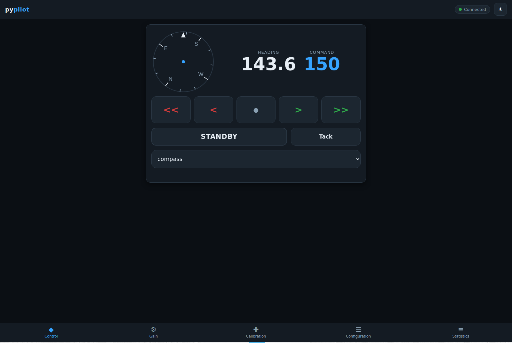
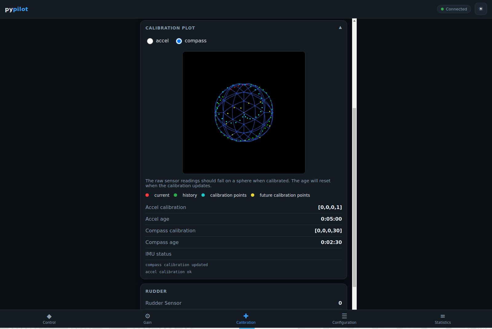
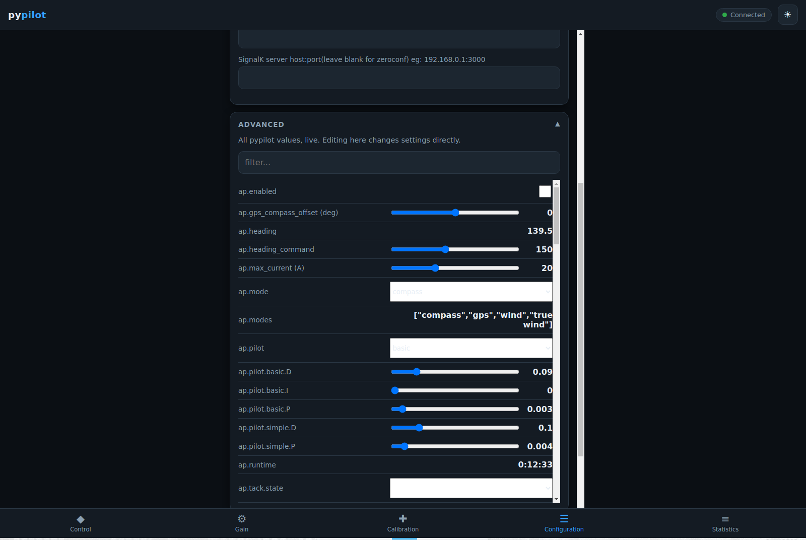
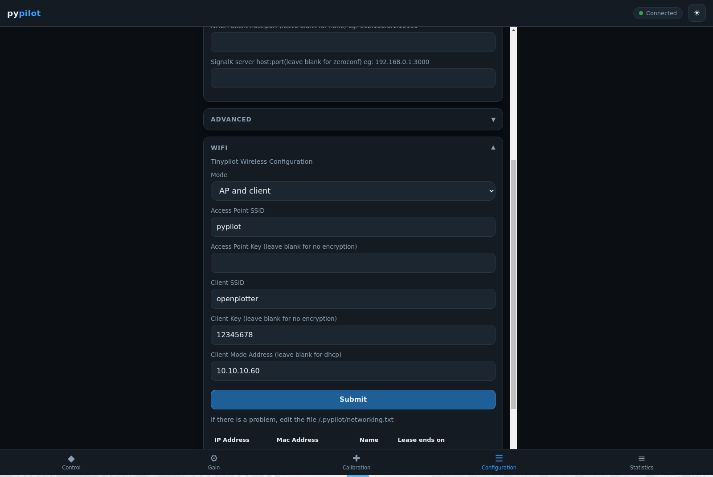

# pypilot-gui

A redesigned, touch-optimized web GUI for [pypilot](https://github.com/pypilot/pypilot),
the open-source marine autopilot. Built for use on a boat: dark / sunlight-readable
theme, large touch targets, and a lightweight vanilla-JS frontend that runs well on a
Raspberry Pi Zero 2 W (tinypilot).

It is a **drop-in replacement** for pypilot's stock web interface — it speaks the exact
same socket.io protocol, so it needs **no autopilot/protocol changes**. The calibration
plot and the full settings browser are embedded directly in the GUI. Embedding the WiFi
config (tinypilot) additionally uses a small, optional tweak to `web.py`'s `index()` route
(see [Optional: WiFi prefill](#optional-wifi-prefill-tinypilot)); without it the WiFi form
still works, just unprefilled.



## Contents

```
templates/index.html          new GUI page (Jinja template, served by pypilot's web.py)
static/pypilot_app.css        styles (dark default + light theme)
static/pypilot_app.js         app logic + canvas compass, vanilla JS
static/pypilot_calplot.js     WebGL calibration plot (embedded), vanilla JS
static/socket.io.min.js       socket.io client (same version pypilot ships)
dev/mock_server.py            simulated autopilot for local dev/testing (no hardware)
dev/requirements.txt          Python deps for the mock server
docs/                         screenshots used in this README
```

## Features

- Big central heading + command readout with a canvas compass rose
- Large port/starboard steering buttons and a prominent **ENGAGE / STANDBY** toggle
- Mode selector (compass / gps / wind / true wind) and **Tack**
- Five tabs (feature parity with the classic UI): **Control / Gain / Calibration /
  Configuration / Statistics**
- Dark, high-contrast, sunlight-readable theme + light toggle
- **Embedded WebGL calibration plot** (accel/compass 3D sphere) in the Calibration tab
- **Embedded "Advanced" editor** in Configuration: every pypilot value with the right
  control (range / checkbox / enum / reset / read-only), live updates and a name filter
- **Embedded WiFi config** (tinypilot only): Master / Managed / Master+Managed, saved via
  the existing `/wifi` endpoint
- No CDN / no internet required, no jQuery or frameworks

### Calibration tab — IMU calibration + embedded 3D plot

The raw accel/compass readings should fall on a sphere when calibrated. Switch between
`accel` and `compass`; colors show current reading, history, calibration points and
predicted future points, alongside the live calibration values, age and IMU status.



### Configuration tab — Advanced value editor

Lists every pypilot value live, each with the appropriate control, plus a name filter.
Editing a value writes it back to pypilot immediately (same as the classic `/client` page).



### Configuration tab — WiFi (tinypilot)

Master (AP), Managed (client), or both. Fields prefill from the Pi's
`~/.pypilot/networking.txt` and the DHCP leases table is shown in AP mode. **Submit** saves
through the existing `/wifi` endpoint without leaving the page.



---

## Install onto a pypilot / tinypilot machine

These files replace the web frontend that pypilot already serves; the Python backend
(`web.py`) and the socket.io protocol are unchanged.

### 1. Find your pypilot `web` folder

It's the directory that contains `web.py`, `templates/` and `static/`. Common locations:

```sh
# installed from pip / packaged (tinypilot)
python3 -c "import pypilot.web, os; print(os.path.dirname(pypilot.web.__file__))"

# or a git checkout
ls ~/pypilot/web/web.py
```

In the commands below, replace `<WEB>` with that path (e.g. `~/pypilot/web` or the printed
package path).

### 2. Back up the originals (so you can revert / keep the classic UI)

```sh
cd <WEB>
cp templates/index.html templates/index.html.orig
# Optional: keep the old GUI reachable at /classic
cp templates/index.html templates/classic.html
```

> The GUI ships a `/classic` link in the **Configuration → More** section. It only works if
> a `templates/classic.html` exists, so copying the original `index.html` to
> `classic.html` (as above) keeps the stock UI one tap away.

### 3. Copy the new files in

On the Pi, from a checkout/copy of this repo:

```sh
cp templates/index.html        <WEB>/templates/index.html
cp static/pypilot_app.css      <WEB>/static/
cp static/pypilot_app.js       <WEB>/static/
cp static/pypilot_calplot.js   <WEB>/static/
# socket.io.min.js already ships with pypilot; only copy if it's missing:
# cp static/socket.io.min.js   <WEB>/static/
```

No-checkout one-liner (copies the four files straight from GitHub into the current folder —
run it from inside `<WEB>`):

```sh
BASE=https://raw.githubusercontent.com/ekhavana/pypilot-gui/pypilot-gui
curl -fsSL $BASE/templates/index.html      -o templates/index.html
curl -fsSL $BASE/static/pypilot_app.css    -o static/pypilot_app.css
curl -fsSL $BASE/static/pypilot_app.js     -o static/pypilot_app.js
curl -fsSL $BASE/static/pypilot_calplot.js -o static/pypilot_calplot.js
```

### 4. Restart the web service and open it

```sh
# tinypilot / systemd
sudo systemctl restart pypilot_web
# or, if you run it by hand:
#   python3 -m pypilot.web
```

Then browse to the Pi on port **8080**, e.g. `http://pypilot.local:8080` or
`http://<pi-ip>:8080` (the same address you used for the old GUI).

### 5. Revert (if ever needed)

```sh
cd <WEB>
cp templates/index.html.orig templates/index.html
sudo systemctl restart pypilot_web
```

### Optional: WiFi prefill (tinypilot)

The embedded WiFi form **submits** correctly out of the box (it POSTs to the existing
`/wifi` route). To also **prefill** it from `~/.pypilot/networking.txt` and show the DHCP
leases table, have `web.py`'s `index()` pass the current config to the template. Factor the
file-reading and lease-building out of the existing `/wifi` route into helpers and reuse
them:

```python
def read_wifi():
    # ... existing networking.txt parsing from the /wifi route, returning the wifi dict ...
    return wifi

def wifi_leases(wifi):
    # ... existing dnsmasq lease-table building from the /wifi route, returning HTML ...
    return leases

@app.route('/')
def index():
    wifi = read_wifi() if tinypilot.tinypilot else {}
    return render_template('index.html',
                           # ... existing args (pypilot_web_port, tinypilot, language, ...) ...
                           wifi=Markup(pyjson.dumps(wifi)),
                           wifi_leases=Markup(wifi_leases(wifi) if tinypilot.tinypilot else ''))
```

A complete, working version of this change lives on the drop-in branch:
<https://github.com/ekhavana/pypilot/pull/1>.

---

## Local development / testing (no autopilot hardware)

A mock server simulates an autopilot speaking pypilot's protocol, so you can run and test
the full GUI on any desktop — no Pi, no IMU, no motor.

### 1. Get the code

```sh
git clone https://github.com/ekhavana/pypilot-gui
cd pypilot-gui
```

### 2. Create a virtualenv and install the mock-server deps

```sh
python3 -m venv .venv
source .venv/bin/activate          # Windows: .venv\Scripts\activate
pip install -r dev/requirements.txt
```

(Deps are just `flask`, `flask-socketio`, `gevent`, `gevent-websocket`.)

### 3. Run the mock server

```sh
python dev/mock_server.py
```

It prints `pypilot-gui mock server: http://localhost:8000`. Open
**<http://localhost:8000>** in any browser.

### 4. What you can exercise against the mock

- **Control:** tap **ENGAGE**, then `<` / `>` / `<<` / `>>` — the simulated heading
  converges toward the command. Change mode and **Tack**.
- **Gain:** drag the P/I/D sliders; values round-trip through the protocol.
- **Calibration:** expand **Calibration Plot**, toggle `accel` / `compass`, and watch the
  3D sphere stream live points.
- **Configuration → Advanced:** all values appear with live updates; type in the filter;
  edit a slider/checkbox/enum and see it echo back.
- **Configuration → WiFi:** the mock runs with `tinypilot=1`, prefills sample values, and
  accepts the form POST (printed to the server console).

The mock is intentionally simple — it doesn't drive a real boat, but it speaks the same
events (`pypilot_values`, `pypilot`, `watch`, value `set`) the real backend does, which is
all the GUI needs.

### Tip: test exactly what the Pi will serve

Because these are the same static files, anything that works against the mock will look
identical on the Pi. The only backend-dependent extra is the WiFi *prefill* described
above; the mock includes a stand-in `/wifi` route so you can see it populated.

## License

GPL-3.0-or-later, matching pypilot.
